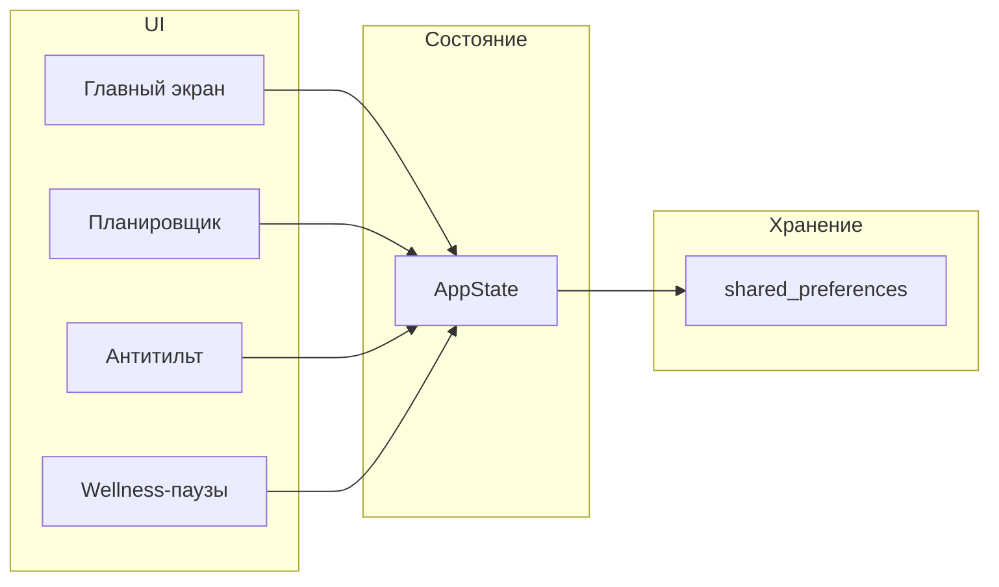

# План прототипа КИБЕРКАЧАЛКА

**Слоган:** «Играй стабильно. Не выгорай.»

**Цель:** приложение следит за нагрузкой и предотвращает выгорание/тильт через один главный индикатор и простые рекомендации.

---

## Текущее состояние

- Проект: Flutter 3.9+, один экран-заглушка в [lib/main.dart](lib/main.dart).
- README описывает старую концепцию (API, база знаний, полный планировщик); для MVP ориентируемся только на новое ТЗ (4 модуля, без API).

---

## Архитектура прототипа




- **Один главный экран** — цвет дня (🟢/🟡/🔴), причина, одна рекомендация, быстрые действия (отметить сессию, настроение, тильт).
- **Состояние:** один источник правды (например, `ChangeNotifier` + `Provider`) с доменной логикой индикатора и антитильта.
- **Хранение:** только локально. Для прототипа достаточно `shared_preferences`: настройки планировщика + сериализованный список «дней» (игровое время, сон, перерывы, настроение, серия поражений). Без Drift/SQLite на первом этапе — быстрее итерации.

---

## МОДУЛЬ 1. Индикатор риска выгорания (CORE)

**Назначение:** сердце приложения — один статус (🟢 баланс / 🟡 перегруз / 🔴 риск выгорания), причина и одна конкретная рекомендация.

**Входные данные (все вручную или из простого ввода):**

- часы игры за день и за неделю (пользователь вводит или «старт/стоп» сессии);
- сон (часы за прошлую ночь);
- количество перерывов за день;
- настроение после сессии (шкала или выбор: плохо / норм / хорошо);
- серия поражений (число, вводит пользователь).

**Логика (упрощённая для прототипа):**

- Правила в коде (без ML): пороги по часам игры/неделю, сну, перерывам, настроению, серии поражений.
- Пример: игра >4 ч в день несколько дней подряд + сон <6 → жёлтый; добавление плохого настроения и серии поражений → красный.
- Функция возвращает: `enum BurnoutLevel { green, yellow, red }`, строку причины, одну рекомендацию (одно предложение).

**UI:** на главном экране — крупный цветовой индикатор, под ним текст «Причина: …», ниже — «Рекомендация: …». Один блок, без лишних экранов.

**Файлы:** доменная логика в `lib/core/burnout_indicator.dart` (или в `lib/features/burnout/`), использование в `AppState` и на главном экране.

---

## МОДУЛЬ 2. Антитильт-режим

**Назначение:** не запрещать игру, а предлагать остановиться и дать один из вариантов выхода.

**Триггеры (в прототипе все через UI):**

- пользователь нажал «злюсь / тильт»;
- введённая серия поражений выше порога (например, ≥3);
- резкое падение настроения (например, с «хорошо» на «плохо» за сессию).

**Поведение:**

- При срабатывании: показывать экран/диалог антитильта (не блокировать приложение).
- Текст в духе: «Сейчас ты играешь хуже не из-за скилла. Хочешь остановиться и сохранить рейтинг?»
- Варианты на выбор: 10-минутный перерыв, физическая разрядка, быстрый разбор ошибок, завершить сессию.
- После выбора — закрыть диалог, при необходимости запустить таймер перерыва (10 мин) или перейти в wellness (упражнения).

**Реализация:** флаг/состояние «антитильт активен» в AppState, экран/диалог с кнопками и текстом, вызов при нажатии «Тильт» или при автоматическом триггере по данным индикатора.

---

## МОДУЛЬ 3. Мини-планировщик нагрузки

**Назначение:** не календарь, а рамки: учёба/работа, сон, макс. время игры в день.

**Данные (настройки пользователя):**

- часы учёбы/работы в день (или «свободный день»);
- цель по сну (часов);
- максимальное время игры в день (часов).

**Логика:**

- «Безопасный лимит» = макс. время игры из настроек.
- При приближении к лимиту (например, осталось 20 мин) — предупреждение на главном экране: «Сегодня безопасно: до X ч. Ты уже Y — риск тильта ↑».
- При превышении — учитывать в индикаторе (модуль 1) и показывать в причине.

**UI:** один экран «Настройки / Планировщик»: поля ввода + сохранение в `shared_preferences`. На главном — одна строка с лимитом и текущим временем игры за день.

**Файлы:** модель настроек, сохранение/загрузка из `shared_preferences`, экран настроек, использование в главном экране и в расчёте индикатора.

---

## МОДУЛЬ 4. Wellness-паузы (минимум)

**Назначение:** напоминания о паузе, правило 20-20-20, 2–3 коротких упражнения (кисти, шея, спина).

**Функции:**

- Напоминание о паузе: локальное уведомление (например, раз в N минут игрового времени или по таймеру). Для прототипа достаточно `flutter_local_notifications` и простой логики «после X минут — напоминание».
- Правило 20-20-20: экран/карточка с текстом «20 сек вдаль, каждые 20 мин» + опционально таймер 20 сек.
- 2–3 упражнения: отдельный экран «Wellness» с кнопками: «Кисти», «Шея», «Спина». Для каждого — короткое описание + таймер 30–60 сек. Медиа: гифка или короткое видео (можно сначала placeholder или одна статичная картинка/иконка), потом при необходимости заменить на реальные гифки.

**Формат:** гифка/картинка + таймер 30–60 сек, без длинных программ.

**Файлы:** экран wellness с подэкранами/карточками для 20-20-20 и для каждого упражнения, таймер-виджет, настройка напоминаний (вкл/выкл, интервал) в настройках планировщика или отдельно.

---

## User flow (как в ТЗ)

1. Зашёл → главный экран → видит **цвет дня** (и при желании лимит из планировщика).
2. Сыграл → нажимает «Отметить сессию» / вводит время или «старт/стоп», отмечает **настроение** (и при желании серию поражений).
3. Получает **обновлённую причину и одну рекомендацию** на том же экране.
4. При тильте — показывается антитильт-блок с одним вопросом и выбором действия.
5. Решает: играть дальше или остановиться (по рекомендации).
6. Периодически — напоминание о wellness; по нажатию — 20-20-20 или упражнения с таймером.

Минимум действий, один главный экран, один индикатор.

---

## Структура файлов (предлагаемая)

```
lib/
├── main.dart
├── app.dart                    # MaterialApp, тема, маршруты
├── core/
│   ├── theme.dart              # Тема (тёмная для кибер-аудитории)
│   ├── constants.dart          # Пороги индикатора, тексты
│   └── storage.dart            # Обёртка над shared_preferences
├── features/
│   ├── burnout/
│   │   ├── burnout_indicator.dart   # Расчёт уровня, причины, рекомендации
│   │   └── widgets/                 # Индикатор для главного экрана
│   ├── tilt/
│   │   ├── tilt_state.dart          # Триггеры и состояние антитильта
│   │   └── anti_tilt_screen.dart    # Диалог/экран с выбором действия
│   ├── planner/
│   │   ├── planner_settings.dart    # Модель настроек, лимиты
│   │   └── planner_screen.dart      # Экран настроек планировщика
│   └── wellness/
│       ├── wellness_screen.dart     # 20-20-20 + список упражнений
│       ├── exercise_screen.dart     # Одно упражнение + таймер
│       └── pause_reminder.dart      # Логика напоминаний
├── home/
│   └── home_screen.dart        # Главный экран: индикатор, причина, рекомендация, кнопки
└── state/
    └── app_state.dart          # Общее состояние (Provider): сессии, настройки, индикатор, тильт
```

Зависимости в `pubspec.yaml` (минимально для прототипа):

- `provider` — состояние.
- `shared_preferences` — настройки и история дней/сессий.
- `flutter_local_notifications` — напоминания о wellness-паузах.

Без: Drift, fl_chart, Dio, API-интеграций, базы знаний.

---

## Порядок реализации

1. **Данные и состояние**
  Модели: день/сессия (дата, часы игры, сон, перерывы, настроение, серия поражений), настройки планировщика. Сохранение/загрузка через `shared_preferences`. `AppState` с провайдером.
2. **Модуль 1 — индикатор**
  Реализовать `burnout_indicator.dart` (пороги, причина, одна рекомендация). Вывести на главный экран виджет с цветом и текстами.
3. **Главный экран**
  Собрать Home: индикатор, блок «Причина / Рекомендация», кнопки «Начать/завершить сессию», «Настроение», «Тильт», навигация в Планировщик и Wellness.
4. **Модуль 3 — планировщик**
  Экран настроек, сохранение лимитов, отображение «безопасного лимита» и предупреждения на главном экране.
5. **Модуль 2 — антитильт**
  Триггеры в AppState, диалог/экран с формулировкой и 4 вариантами, при необходимости переход к таймеру перерыва или wellness.
6. **Модуль 4 — wellness**
  Экран с 20-20-20 и 2–3 упражнениями, таймер 30–60 сек, напоминания через `flutter_local_notifications`.
7. **Полировка**
  Тексты по ТЗ, тёмная тема, обновление README под новый MVP (без API и сложной аналитики).

---

## Риски и упрощения

- **Точность индикатора:** в прототипе достаточно жёстких порогов в коде; позже можно вынести в конфиг или донастроить по отзывам.
- **Напоминания:** на части платформ для фоновых напоминаний нужна настройка (каналы уведомлений, разрешения). В прототипе можно сначала показывать напоминание только когда приложение открыто (таймер от последней паузы).
- **Медиа для упражнений:** первый вариант — текст + таймер; гифки/видео добавить при наличии контента.

После реализации прототипа можно замерить: возвращаются ли пользователи и меняется ли поведение (меньше тильта и усталости), и на основе этого решить, вводить ли API, базу знаний и углублённую аналитику.